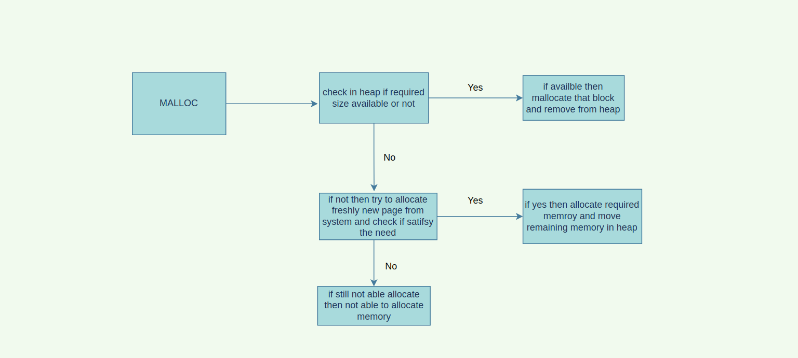
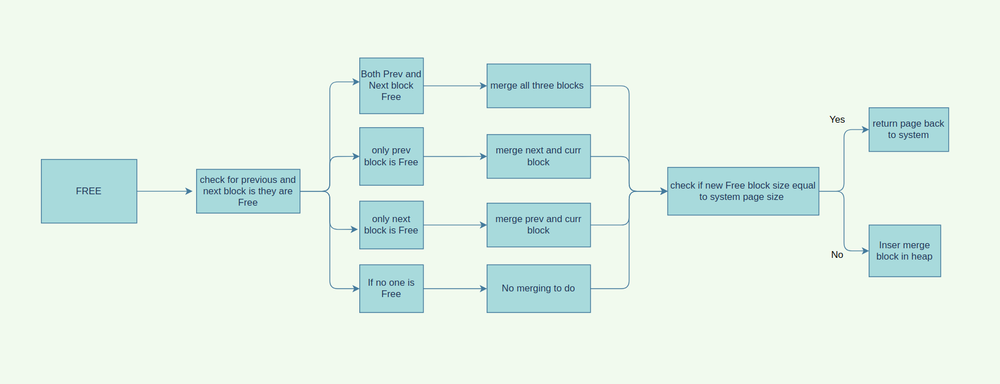
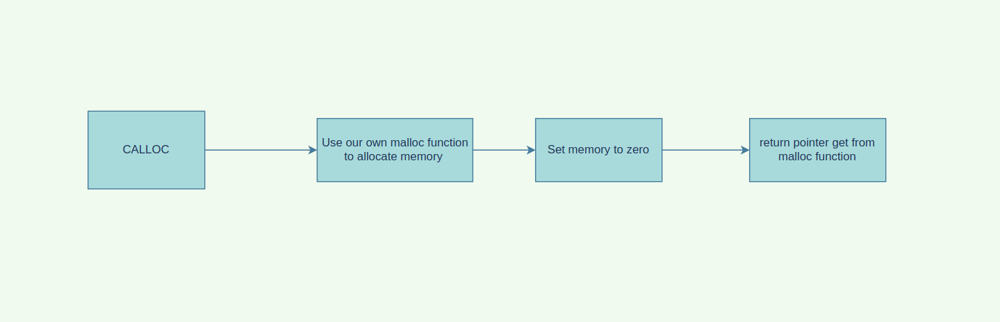
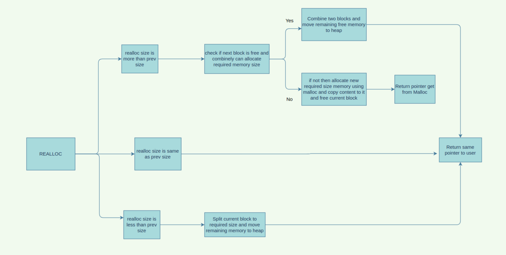

# Heap_Manager
Heap Manager made in C language as Project For DSA-II Course.

Name:- Siddhesh Pawar </br>
MIS:- 112003112       </br>
Div:-2

</br>

# About Project
- Efficient and FastMemory Management is very important topic in industry.
- We implement our own Heap Manager here which take care of memory allocation and deallocation in efficient way.
- The complete Project is implemented in C language.
- We implement here Malloc,Free,Calloc and Realloc calls here in this project.
- Data Structures used:
  1. Doubly Linked List
  2. Heap data Structure

</br>

# Usage

Make sure you have gcc installed
You can check by typing the following in your terminal

```
$ gcc --version
```

Download the repository (May be use git clone or download zip folder of project).

```
$ git clone  https://github.com/Siddhesh4501/Heap_Manager.git
```

Copy `mm.c`, `mm.h`, `heap.c` and `heap.c` from the **src/** folder to your project directory and include `mm.h` in your main file instead of ```<stdlib.h>``` library

```
#include "mm.h"
```

Compile program by using

```
gcc yourfiles.c mm.c heap.c -o yourfile
```
Execute ```./final``` to see output of your code.

```
./final
```

</br>

### Logic Implemented in this Project

## Malloc


## Free


## Calloc


## Realloc



### References
- [Zero length array](https://gcc.gnu.org/onlinedocs/gcc/Zero-Length.html)
- [Offset of struct field](https://www.geeksforgeeks.org/the-offsetof-macro/)
- [mmap and munmap](https://www.tutorialspoint.com/unix_system_calls/mmap.htm)
- [getpagesize](https://man7.org/linux/man-pages/man2/getpagesize.2.html)
- [fordeleteinternalnodinHeap](http://www.mathcs.emory.edu/~cheung/Courses/171/Syllabus/9-BinTree/heap-delete.html)
